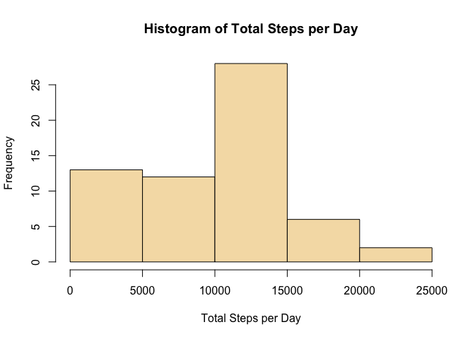
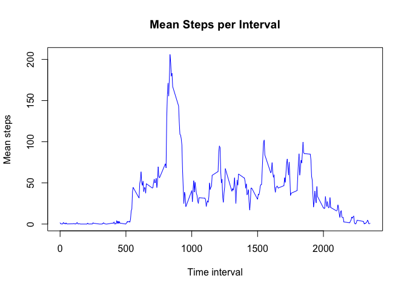
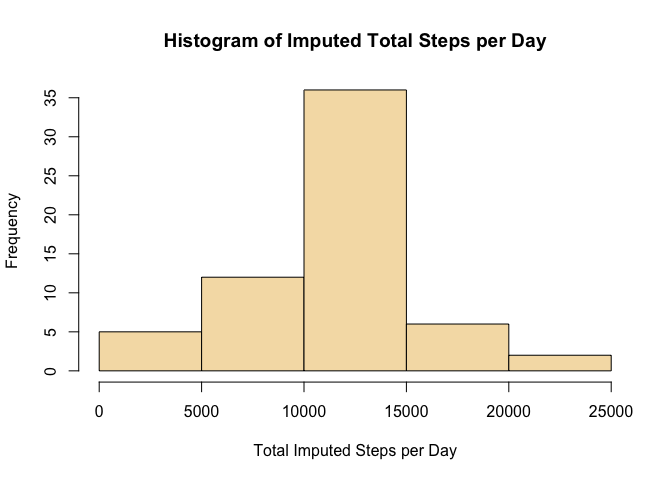
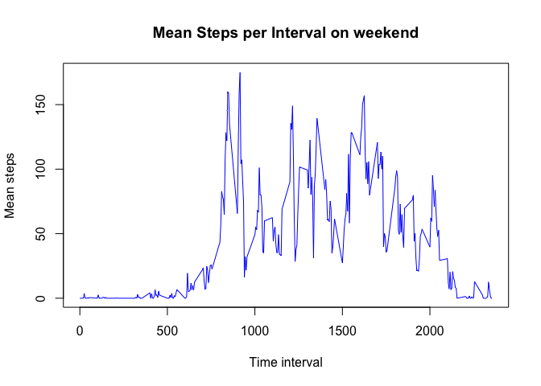
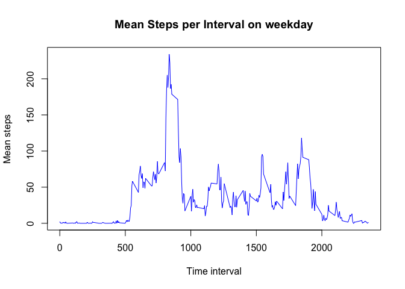

# Reproducible Research: Peer Assessment 1
***  
## Loading and preprocessing the data
1. Download the file and read the CSV from the zip file.

```r
temp <- tempfile()
download.file("http://d396qusza40orc.cloudfront.net/repdata%2Fdata%2Factivity.zip",temp)
activityData <- read.csv(unz(temp, "activity.csv"))
unlink(temp)
```

2. Review the data

```r
head(activityData)
```

```
##   steps       date interval
## 1    NA 2012-10-01        0
## 2    NA 2012-10-01        5
## 3    NA 2012-10-01       10
## 4    NA 2012-10-01       15
## 5    NA 2012-10-01       20
## 6    NA 2012-10-01       25
```

***
## What is mean total number of steps taken per day?
1. Summarize the total steps per day

```r
library(dplyr)
totalStepsPerDay <- activityData %>%
  group_by(date) %>%
  summarize(totSteps = sum(steps, na.rm = T)) 
head(totalStepsPerDay)
```

```
## Source: local data frame [6 x 2]
## 
##         date totSteps
## 1 2012-10-01        0
## 2 2012-10-02      126
## 3 2012-10-03    11352
## 4 2012-10-04    12116
## 5 2012-10-05    13294
## 6 2012-10-06    15420
```
2. Create the histogram

```r
hist(totalStepsPerDay$totSteps, 
     main="Histogram of Total Steps per Day",
     ylab = "Frequency",
     xlab = "Total Steps per Day",
     col = "wheat")
```

 
  
3. Calculate the mean and median steps per day
  

```r
mean(totalStepsPerDay$totSteps)
```

```
## [1] 9354.23
```
  

```r
median(totalStepsPerDay$totSteps)
```

```
## [1] 10395
```
  
***
## What is the average daily activity pattern?
1. Calculate the mean steps per interval  

```r
meanStepsPerInt <- activityData %>%
  group_by(interval) %>%
  summarize(meanSteps = mean(steps, na.rm = T)) 
head(meanStepsPerInt)
```

```
## Source: local data frame [6 x 2]
## 
##   interval meanSteps
## 1        0 1.7169811
## 2        5 0.3396226
## 3       10 0.1320755
## 4       15 0.1509434
## 5       20 0.0754717
## 6       25 2.0943396
```
2. Create the line graph of mean steps per interval

```r
plot(meanStepsPerInt, 
     type = "l",
     main = "Mean Steps per Interval",
     ylab = "Mean steps",
     xlab = "Time interval",
     col = "blue")
```

 
  
3. Calculate the interval with max steps  

```r
library(dplyr)
arrange(meanStepsPerInt, desc(meanSteps))[1,]
```

```
## Source: local data frame [1 x 2]
## 
##   interval meanSteps
## 1      835  206.1698
```

***
## Imputing missing values
1. Calculate the number of NAs  

```r
sum(is.na(activityData$steps))
```

```
## [1] 2304
```
  
2. Strategy for imputing values: use the dataset mean for the intervals where data is NA 

3. Create dataset with imputed values  

```r
library(sqldf)

imputedActivityData <- sqldf('select case when ad.steps != "NA" then 
                             ad.steps else mspi.meanSteps end as imputed_steps, ad.date, ad.interval 
                             from activityData ad left join meanStepsPerInt mspi 
                             on ad.interval = mspi.interval')
head(imputedActivityData)
```

```
##   imputed_steps       date interval
## 1     1.7169811 2012-10-01        0
## 2     0.3396226 2012-10-01        5
## 3     0.1320755 2012-10-01       10
## 4     0.1509434 2012-10-01       15
## 5     0.0754717 2012-10-01       20
## 6     2.0943396 2012-10-01       25
```

4. Summarize the imputed total steps per day

```r
library(dplyr)
totalimpStepsPerDay <- imputedActivityData %>%
  group_by(date) %>%
  summarize(totSteps = sum(imputed_steps, na.rm = T)) 
head(totalimpStepsPerDay)
```

```
## Source: local data frame [6 x 2]
## 
##         date totSteps
## 1 2012-10-01 10766.19
## 2 2012-10-02   126.00
## 3 2012-10-03 11352.00
## 4 2012-10-04 12116.00
## 5 2012-10-05 13294.00
## 6 2012-10-06 15420.00
```
  
5. Create histogram  

```r
hist(totalimpStepsPerDay$totSteps, 
     main="Histogram of Imputed Total Steps per Day",
     ylab = "Frequency",
     xlab = "Total Imputed Steps per Day",
     col = "wheat")
```

 
  
6. Calculate the mean and median imputed steps per day
  

```r
mean(totalimpStepsPerDay$totSteps)
```

```
## [1] 10766.19
```
  

```r
median(totalimpStepsPerDay$totSteps)
```

```
## [1] 10766.19
```
  
***
## Are there differences in activity patterns between weekdays and weekends?  

1.  Create a factor variable for weekend days (1 if weekend 0 if week day)


```r
activityData$weekDayNumber <- as.POSIXlt(activityData$date)$wday

activityData$weekendInd <- ifelse(activityData$weekDayNumber==0 | activityData$weekDayNumber==6,1,0)
head(activityData, 10)
```

```
##    steps       date interval weekDayNumber weekendInd
## 1     NA 2012-10-01        0             1          0
## 2     NA 2012-10-01        5             1          0
## 3     NA 2012-10-01       10             1          0
## 4     NA 2012-10-01       15             1          0
## 5     NA 2012-10-01       20             1          0
## 6     NA 2012-10-01       25             1          0
## 7     NA 2012-10-01       30             1          0
## 8     NA 2012-10-01       35             1          0
## 9     NA 2012-10-01       40             1          0
## 10    NA 2012-10-01       45             1          0
```

2. Create summary by weekendInd and interval


```r
meanStepsPerWIInt <- activityData %>%
  group_by(weekendInd, interval) %>%
  summarize(meanSteps = mean(steps, na.rm = T)) 
head(meanStepsPerWIInt)
```

```
## Source: local data frame [6 x 3]
## Groups: weekendInd
## 
##   weekendInd interval meanSteps
## 1          0        0 2.3333333
## 2          0        5 0.4615385
## 3          0       10 0.1794872
## 4          0       15 0.2051282
## 5          0       20 0.1025641
## 6          0       25 1.5128205
```

3. Create the line graph of mean steps per interval for weekend

```r
library(dplyr)
weekend <- filter(meanStepsPerWIInt, weekendInd == 1)
weekend <- weekend[,2:3]
head(weekend)
```

```
## Source: local data frame [6 x 2]
## 
##   interval meanSteps
## 1        0  0.000000
## 2        5  0.000000
## 3       10  0.000000
## 4       15  0.000000
## 5       20  0.000000
## 6       25  3.714286
```

```r
plot(weekend, 
     type = "l",
     main = "Mean Steps per Interval on weekend",
     ylab = "Mean steps",
     xlab = "Time interval",
     col = "blue")
```

 
  
4. Create the line graph of mean steps per interval for weekday

```r
library(dplyr)
weekend <- filter(meanStepsPerWIInt, weekendInd == 0)
weekend <- weekend[,2:3]
head(weekend)
```

```
## Source: local data frame [6 x 2]
## 
##   interval meanSteps
## 1        0 2.3333333
## 2        5 0.4615385
## 3       10 0.1794872
## 4       15 0.2051282
## 5       20 0.1025641
## 6       25 1.5128205
```

```r
plot(weekend, 
     type = "l",
     main = "Mean Steps per Interval on weekday",
     ylab = "Mean steps",
     xlab = "Time interval",
     col = "blue")
```

 
  
5. There is more activity throughout the day on the weekends.  During the week activity is focused in the morning and afternoon.
